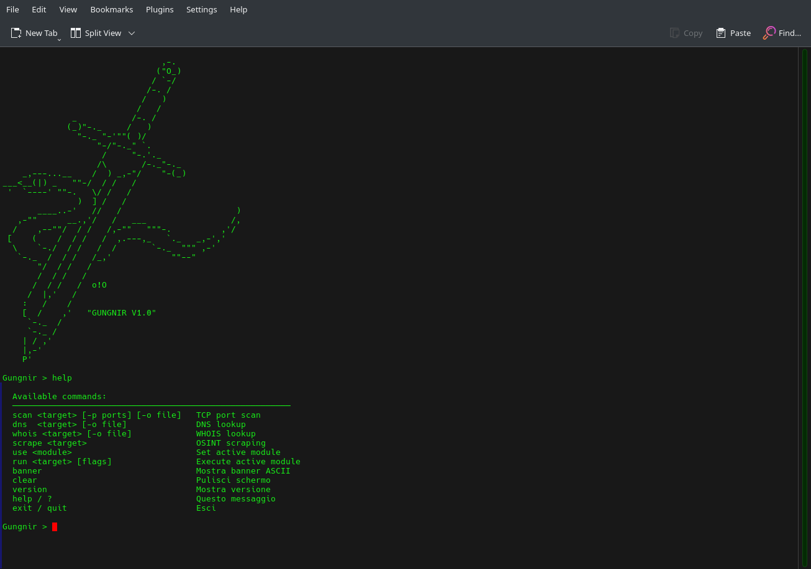

<div align="center">



# ⚔️ Gungnir

### **Fast • Modular • Local-first OSINT Framework written in C++20**

[](https://github.com/PIXELQUADRO07/Gungnir/actions)
[](https://opensource.org/licenses/MIT)
[](https://github.com/PIXELQUADRO07/Gungnir/stargazers)
[](https://en.wikipedia.org/wiki/C%2B%2B20)

**🔍 Reconnaissance • 📡 Scanning • 🎯 Threat Intelligence • 📊 Advanced Reporting**

</div>

---

## 📋 Table of Contents

- [Overview](#overview)
- [✨ Key Features](#-key-features)
- [🏗️ Architecture](#️-architecture)
- [🚀 Quick Start](#-quick-start)
- [📦 Dependencies](#-dependencies)
- [⚙️ Configuration](#️-configuration)
- [📖 Commands Reference](#-commands-reference)
- [🗺️ Roadmap](#️-roadmap)
- [📄 License](#-license)

---

## Overview

**Gungnir** is a high-performance OSINT (Open-Source Intelligence) framework designed for modern security professionals, researchers, and penetration testers. Built with modern C++20, it combines cutting-edge reconnaissance, network scanning, service discovery, threat intelligence analysis, and automated reporting into a single, interactive command-line interface.

### Why Gungnir?

| 🚄 | **Lightning Fast** | Multi-threaded TCP scanning with minimal overhead |
|:---|:---|:---|
| 🧩 | **Modular Design** | Extensible plugin architecture for custom reconnaissance modules |
| 🏠 | **Local-First** | All operations run locally with no cloud dependencies or data leaks |
| 💻 | **Modern C++** | Leverages C++20 features for safety, performance, and clarity |
| 🎯 | **Automation Ready** | Batch processing and integrated reporting for large-scale assessments |
| 🐳 | **Containerized** | Full Docker support for consistent deployment across environments |

---

## ✨ Key Features

### Core Reconnaissance
- **Multi-threaded TCP Scanning** - Fast port enumeration with configurable concurrency
- **DNS Reconnaissance** - Subdomain enumeration, record lookups, and zone transfers
- **WHOIS Lookups** - Domain and IP ownership intelligence
- **Service Detection** - Nmap integration for OS and service fingerprinting

### Intelligence & Analysis
- **Threat Intelligence** - Integration with VirusTotal, Shodan, and custom feeds
- **Vulnerability Matching** - Searchsploit integration for CVE correlation
- **Historical Analysis** - SQLite-backed data persistence for comparative studies
- **Graph Exports** - Relationship visualization for complex networks

### Reporting & Output
- **Multi-Format Reports** - HTML5 dashboards and JSON structured data
- **Batch Processing** - Scan multiple targets with unified reporting
- **Export Options** - Flexible data extraction for downstream tools
- **Interactive Shell** - GNU Readline support for seamless workflows

### Infrastructure
- **Docker Support** - Production-ready containerization
- **Cross-Platform** - Linux, macOS, and WSL support
- **CI/CD Integration** - GitHub Actions workflow included
- **Persistent Storage** - SQLite database for scan history and analysis

---

## 🏗️ Architecture

```
┌─────────────────┐
│   Target Spec   │
│  (Domain/IP)    │
└────────┬────────┘
         │
    ┌────▼────┐
    │  Input  │
    │ Parser  │
    └────┬────┘
         │
    ┌────▼──────────────────────┐
    │   Reconnaissance Engine    │
    ├───────────────────────────┤
    │ • DNS Recon               │
    │ • WHOIS Lookup            │
    │ • Subdomain Enumeration   │
    └────┬──────────────────────┘
         │
    ┌────▼──────────────┐
    │  Scanning Module  │
    ├──────────────────┤
    │ • TCP Scans      │
    │ • Service Probe  │
    └────┬─────────────┘
         │
    ┌────▼──────────────────────┐
    │  Intelligence Gathering   │
    ├───────────────────────────┤
    │ • Threat Intel (VT/Shodan)│
    │ • CVE Correlation (S-ploit)│
    │ • Historical Analysis     │
    └────┬──────────────────────┘
         │
    ┌────▼──────────────┐
    │  Report Generator │
    ├──────────────────┤
    │ • HTML/JSON      │
    │ • Graphs/Maps    │
    │ • Export Tools   │
    └────┬─────────────┘
         │
    ┌────▼────────┐
    │   Output    │
    │  (Reports)  │
    └─────────────┘
```

---

## 🚀 Quick Start

### Prerequisites
- GCC 11+ or Clang 13+ with C++20 support
- CMake 3.20+
- libcurl (with OpenSSL)
- SQLite3

### Build from Source

```bash
# Clone the repository
git clone https://github.com/PIXELQUADRO07/Gungnir.git
cd Gungnir

# Run the setup script (installs dependencies)
sudo ./setup.sh

# Build the project
cmake -B build -DCMAKE_BUILD_TYPE=Release
cmake --build build --parallel $(nproc)

# Run
./build/Gungnir
```

### Docker Quick Start

```bash
# Build the Docker image
docker build -t gungnir:latest .

# Run in interactive mode
docker run -it --rm gungnir:latest

# Run with volume mount for persistent storage
docker run -it --rm -v $(pwd)/data:/app/data gungnir:latest
```

### Interactive Session Example

```bash
$ ./Gungnir
╔═══════════════════════════════════════════════════════════════╗
║              🗡️  GUNGNIR - OSINT Framework v2.0             ║
║         Fast • Modular • Local-first Intelligence           ║
╚═══════════════════════════════════════════════════════════════╝

Gungnir > scan example.com -p 1-65535 -t 4
[*] Starting TCP scan on example.com:1-65535
[+] Found 8 open ports
[+] Scan completed in 2.341s

Gungnir > dns example.com
[*] DNS reconnaissance on example.com
[+] Found 12 A records
[+] Found 3 MX records
[+] Found 2 TXT records

Gungnir > nmap example.com -sV
[*] Running Nmap service detection
[+] Identified 4 services: HTTP/1.1, SSH, SMTP, DNS

Gungnir > threat example.com
[*] Fetching threat intelligence
[+] Last seen: 2 months ago
[+] Reputation: Medium
[+] 0 known malware associations

Gungnir > report example.com --format html --output reports/
[+] Report generated: reports/example.com_2026-06-16.html
[+] Total time: 15.234s
```

---

## 📦 Dependencies

### Required
- **C++20 Compiler** - GCC 11.0+, Clang 13.0+, or MSVC 19.29+
- **CMake** - 3.20 or later
- **libcurl** - HTTP client library (dev package)
- **SQLite3** - Embedded database (dev package)

### Optional
- **Nmap** - Network mapping (`nmap` binary required in PATH)
- **Searchsploit** - Exploit database queries
- **GNU Readline** - Enhanced shell interface
- **OpenSSL** - For HTTPS/TLS support

### Installation

**Ubuntu/Debian:**
```bash
sudo apt-get install -y \
  build-essential cmake git \
  libcurl4-openssl-dev \
  libsqlite3-dev \
  libreadline-dev \
  nmap
```

**macOS (Homebrew):**
```bash
brew install cmake curl sqlite3 readline nmap
```

**CentOS/RHEL:**
```bash
sudo yum groupinstall -y "Development Tools"
sudo yum install -y cmake libcurl-devel sqlite-devel readline-devel nmap
```

---

## ⚙️ Configuration

Create a `.gungnirrc` file in your home directory or specify via `--config`:

```ini
# API Keys
VT_API_KEY=your_virustotal_key_here
SHODAN_API_KEY=your_shodan_key_here

# Scanning Defaults
DEFAULT_THREADS=4
DEFAULT_TIMEOUT=5000
TCP_SCAN_TIMEOUT=10

# Output
DEFAULT_FORMAT=json
REPORT_STYLE=dark
STORE_HISTORY=true

# Paths
NMAP_PATH=/usr/bin/nmap
SEARCHSPLOIT_PATH=/usr/bin/searchsploit

# Persistence
DB_PATH=~/.gungnir/gungnir.db
LOG_LEVEL=info
```

**Environment Variables:**
```bash
export GUNGNIR_VT_KEY="your_key"
export GUNGNIR_SHODAN_KEY="your_key"
export GUNGNIR_THREADS=8
export GUNGNIR_TIMEOUT=5000
```

---

## 📖 Commands Reference

| Command | Syntax | Description |
|:---|:---|:---|
| **scan** | `scan <target> [-p ports] [-t threads]` | Perform rapid TCP port scanning |
| **dns** | `dns <domain> [--deep]` | DNS reconnaissance and subdomain discovery |
| **whois** | `whois <domain\|ip>` | WHOIS ownership and registration info |
| **nmap** | `nmap <target> [-sV] [-O]` | Service/OS detection via Nmap |
| **threat** | `threat <ip\|domain>` | Query threat intelligence feeds |
| **searchsploit** | `searchsploit <keyword>` | Find relevant CVEs and exploits |
| **report** | `report <target> [--format {html,json}]` | Generate comprehensive reports |
| **history** | `history [--filter target] [--limit 10]` | View scan history |
| **export** | `export <scan_id> --format {json,csv}` | Export scan data |
| **graph** | `graph <scan_id> [--format svg]` | Generate relationship graphs |
| **help** | `help [command]` | Display command help |
| **exit** | `exit` | Exit the program |

**Advanced Usage:**
```bash
# Batch scan with multiple targets
Gungnir > scan targets.txt -p 1-1000 -t 8 --batch

# Deep DNS reconnaissance with automation
Gungnir > dns -d *.example.com --deep --output dns_results.json

# Multi-stage assessment
Gungnir > scan example.com -p 1-1000 && nmap example.com -sV && threat example.com

# Generate detailed reports
Gungnir > report example.com --format html --include all --output /tmp/reports/
```

---

## 🗺️ Roadmap

### Current (v2.0)
- [x] Interactive CLI shell with history
- [x] Multi-threaded TCP scanning
- [x] DNS reconnaissance module
- [x] Nmap integration
- [x] Threat intelligence integration
- [x] HTML & JSON reporting
- [x] Docker support
- [x] SQLite persistence

### Planned (v2.5)
- [ ] **Plugin System** - Extensible module architecture
- [ ] **Distributed Scanning** - Remote agent coordination
- [ ] **API Server** - REST API for headless operation
- [ ] **Web Dashboard** - Real-time monitoring interface
- [ ] **TLS/SSL Analysis** - Certificate chain validation
- [ ] **Credential Extraction** - Pattern-based data harvesting

### Future (v3.0+)
- [ ] Machine learning-based anomaly detection
- [ ] Automated exploitation suggestions
- [ ] Multi-cloud reconnaissance (AWS, Azure, GCP)
- [ ] Real-time correlation engine
- [ ] Mobile client app

---

## 🤝 Contributing

We welcome contributions! Here's how:

1. **Fork** the repository
2. **Create** a feature branch: `git checkout -b feature/amazing-feature`
3. **Commit** your changes: `git commit -m 'Add amazing feature'`
4. **Push** to the branch: `git push origin feature/amazing-feature`
5. **Submit** a Pull Request

Please ensure:
- ✅ Code follows C++ style guidelines
- ✅ All tests pass (`cmake --build build --target test`)
- ✅ Documentation is updated
- ✅ Commit messages are descriptive

---

## 📝 License

This project is licensed under the **MIT License** - see the [LICENSE](LICENSE) file for details.

```
MIT License

Permission is hereby granted, free of charge, to any person obtaining a copy
of this software and associated documentation files (the "Software"), to deal
in the Software without restriction, including without limitation the rights
to use, copy, modify, merge, publish, distribute, sublicense, and/or sell
copies of the Software, subject to the following conditions:

The above copyright notice and this permission notice shall be included in all
copies or substantial portions of the Software.
```

---

## 📞 Support & Contact

- 📧 **Email**: [Your Email]
- 🐛 **Issues**: [Report a bug](https://github.com/PIXELQUADRO07/Gungnir/issues)
- 💬 **Discussions**: [Join community discussions](https://github.com/PIXELQUADRO07/Gungnir/discussions)
- 📚 **Docs**: [Full documentation](https://github.com/PIXELQUADRO07/Gungnir/wiki)

---

<div align="center">

### 🌟 If Gungnir helps your security work, please consider giving it a star!

[](https://starchart.cc/PIXELQUADRO07/Gungnir)

---

**Built with ⚔️ for the security community**

*Last Updated: June 2026 | Made with ❤️ by PIXELQUADRO07*

</div>
